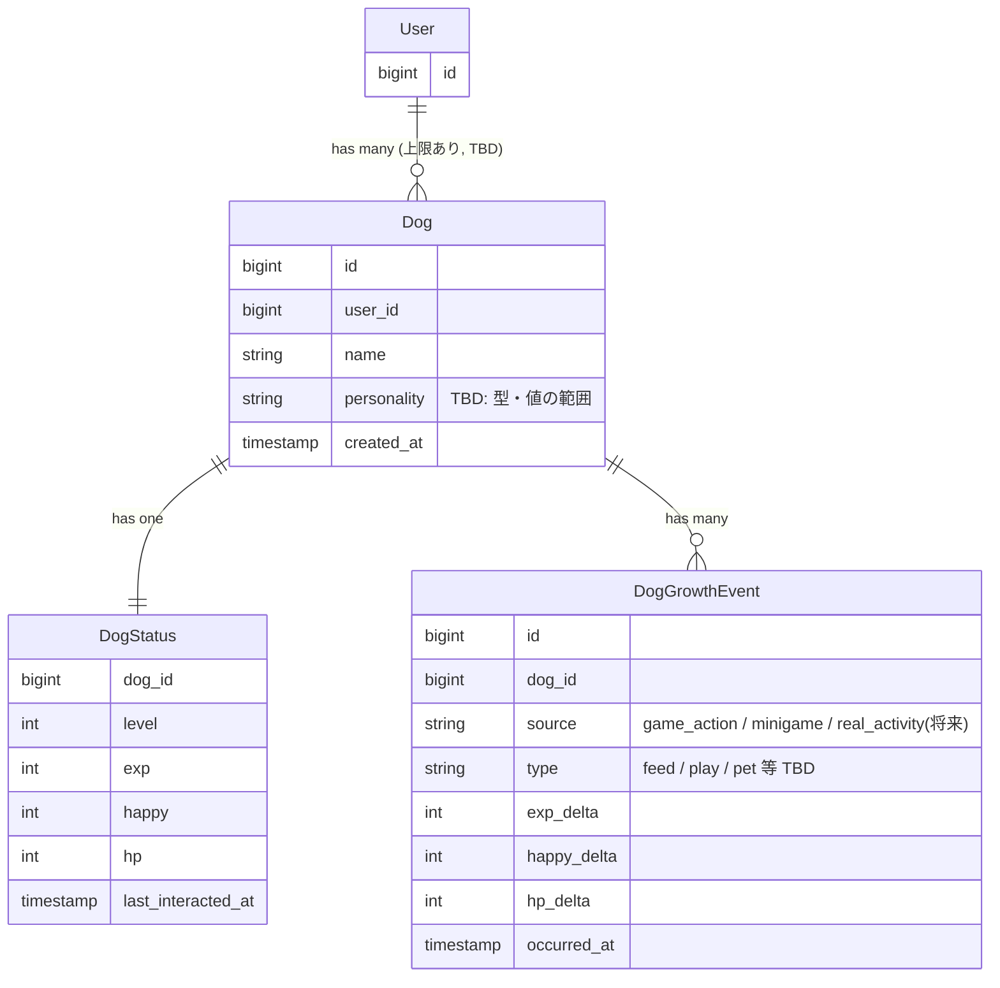

# Domain Model — pawverse

`docs/notes/draft.md` の内容をベースにしたドメインモデルの叩き台。
MVPスコープは [`docs/mvp.md`](./mvp.md) を参照。TBDと書いてある箇所はまだ決まっていない部分。

---

## 1. 全体像

---

## 2. エンティティごとの責務

### Dog（相棒犬）

「その犬が何者か」を表す、比較的不変な情報を持つ。

- ステータス（可変値）は一切持たない → `DogStatus` に委譲
- `personality`（性格）はここに持たせる想定（不変な属性のため）

### DogStatus（現在のステータス）

「今、犬がどんな状態か」の唯一の情報源（single source of truth）。

- `Dog : DogStatus = 1 : 1`
- 前バージョンの `docs/dog-system.md` にあった最重要ルールを継承:
  **直接更新禁止。必ず `DogStatusService` のようなService経由で更新する**
- `last_interacted_at` を持たせておくと、「放置系（時間経過でステータス変化）」の計算基準にできる
- **減衰の計算方式は「都度計算方式」に決定**（MVP時点）: 画面表示のたびに `now() - last_interacted_at` から経過時間を算出し、その場でHP/Happyの減衰を計算する。cron/Schedulerによるバッチ処理は行わない
  - バッチ方式（Laravel Schedulerで定期更新）はMVP後の学習用拡張ポイントとして残す（[5. 将来の拡張ポイント](#5-将来の拡張ポイント今は実装しない)参照）
  - 具体的な減衰率・計算式自体はTBD

### DogGrowthEvent（成長イベントログ）

「何がきっかけでステータスが変化したか」を記録する。

- `source` を持たせることで、ゲーム内アクションと将来のリアル犬連携を同じ形で扱える
  - 今回実装するのは `game_action` / `minigame` のみ
  - 将来 `RealDogActivity` を復活させたくなったら、`source: 'real_activity'` のイベントを発行するだけで済む設計にしておく（＝疎結合にする、という draft.md の方針をここで実現）
- Serviceがステータスを更新するたびに、このイベントも一緒に記録する想定

---

## 3. ビジネスルール（現時点でわかっているもの）

- `DogStatus` は直接更新禁止。必ずServiceを経由する
- 複数飼育は可能だが上限を設ける（具体的な数字はTBD。**MVPでは上限チェック自体は未実装でよい**）
- レベルが上がるほど、次のレベルに必要な経験値は増えていく（計算式はTBD）
- ステータス減衰は都度計算方式（上記DogStatus参照）

---

## 4. 未決定事項（TBD）

これらは実装に入る前に決める必要がある項目。`docs/notes/draft.md` に殴り書きしながら詰めていくのが良さそう。

- [ ] `personality`（性格）の型・具体的な値（固定の選択肢？自由入力？）
- [ ] 経験値からレベルを算出する計算式
- [ ] `happy` / `hp` の具体的な減衰率・計算式（計算方式＝都度計算、は決定済み）
- [ ] 複数飼育の上限数（MVP対象外、後回し）
- [ ] `DogGrowthEvent.type` の具体的な種類一覧（MVPで実装するお世話アクション3種を決めたら確定する）
- [ ] ミニゲームの種類・回数制限の有無（MVP対象外。B/C案のタイミングで検討）

---

## 5. 将来の拡張ポイント（今は実装しない）

- `RealDogActivity` 連携: `DogGrowthEvent.source` に `real_activity` を追加し、リアル犬の活動記録から成長イベントを発行する
- 外部API連携: 犬種情報などの無料APIを使う場合、`Dog` に犬種を表すフィールドを追加する形になりそう（今は未着手）

